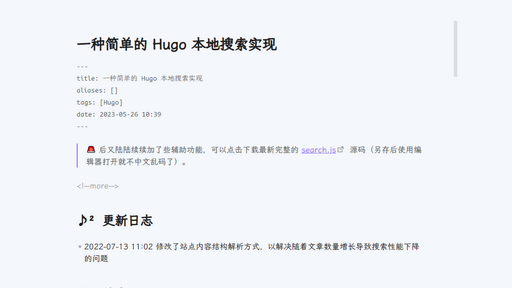
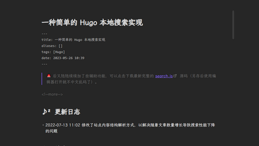

喜欢的话，给颗小星星 ⭐️ 鼓励一下吧 ~

[📘 使用指南：一款简约的 Obsidian 主题](https://aituyaa.com/%E4%B8%80%E6%AC%BE%E7%AE%80%E7%BA%A6%E7%9A%84-obsidian-%E4%B8%BB%E9%A2%98/)

A pure obsidian theme. like:

**预览**



`> Light Mode`



`> Dark Mode`

**使用**

已合并到官方主题仓库，可以 Obsidian 的官方主题仓库（`Settings / Appearance / Themes > Manage`）直接搜索 `Virgo` 进行安装。

当然，你也可以手动操作，如下：

```
# 进行你的 Obsidian 仓库根目录中的 .obsidian
git clone https://github.com/loveminimal/obsidian-theme-virgo.git themes/Virgo
```

之后在 Obsidian 设置中选择该主题即可。
